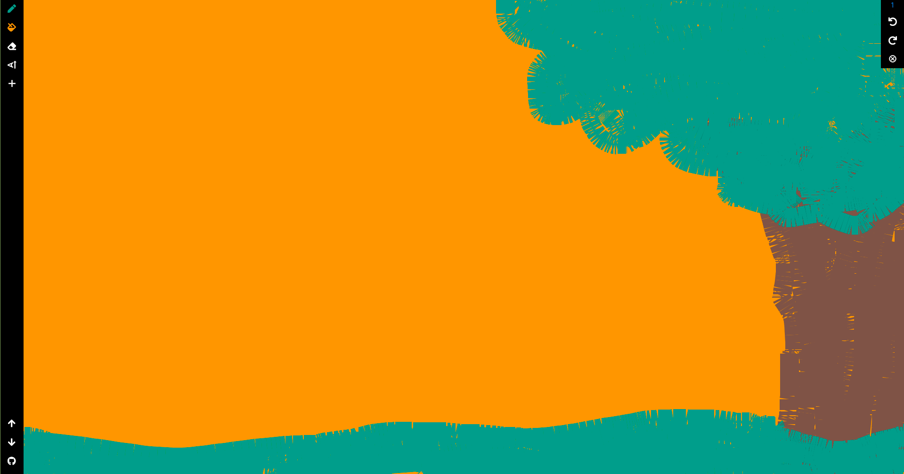
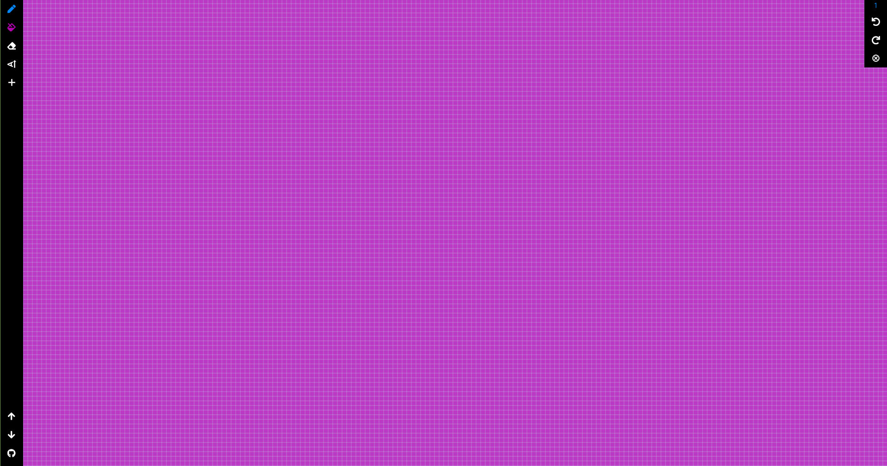
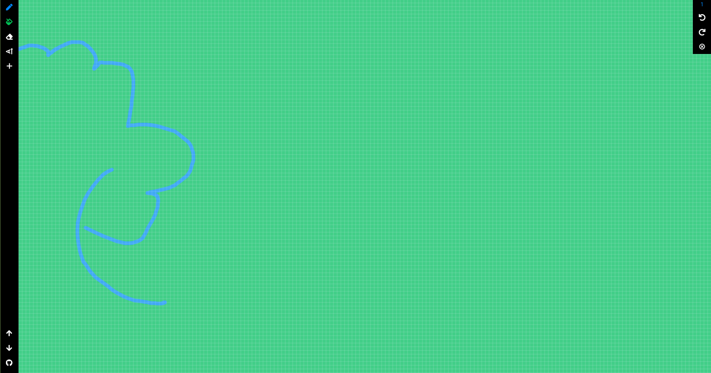

 

# DrawingBoard 

### Free online drawing application for all ages.

<div align="center">
    
    <a href="https://paypal.me/mrmayurrrr">
        
    </a>
</div>

## Screenshots

|||


## Installation

Linux:

```sh
The Linux version of the app will be launched soon.
```

Windows:

```sh
The Windows version of the app will be launched soon.
```

Web:
[DrawingBoard](https://drawingboardio.web.app/#/ "Free online drawing application for all ages.")


## Bugs or Reports

If you encounter any problems feel free to open an [issue](https://github.com/mrmayurgithub/DrawingBoard/issues/new?assignees=&labels=&template=bug_report.md&title=). If you feel the app is missing a feature, please raise a [ticket](https://github.com/mrmayurgithub/DrawingBoard/issues/new?assignees=&labels=&template=feature_request.md&title=) on GitHub and I'll look into it. Pull requests are also welcome.

## Donate

> If you found this project helpful or you learned something from the source code and want to thank me, consider buying me a cup of ☕
> - [PayPal](https://paypal.me/mrmayurrrr)

## License

DrawingBoard is licensed under `Apache License`. View [License](LICENSE.md)


